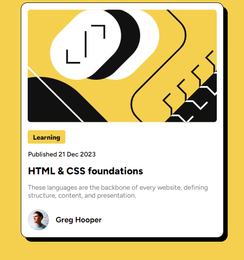
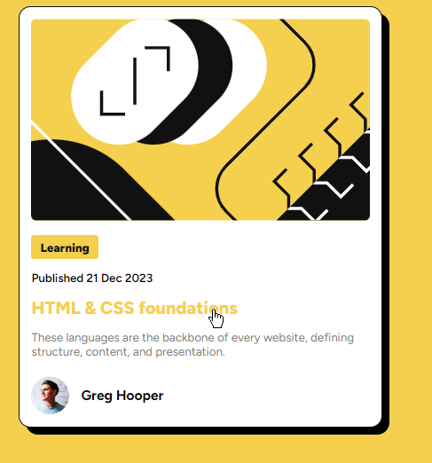

# Frontend Mentor - Blog preview card solution

This is a solution to the [Blog preview card challenge on Frontend Mentor](https://www.frontendmentor.io/challenges/blog-preview-card-ckPaj01IcS). Frontend Mentor challenges help us to improve our coding skills by building realistic projects.

## Table of contents

- [Overview](#overview)
  - [The challenge](#the-challenge)
  - [Screenshot](#screenshot)
- [My process](#my-process)
  - [Built with](#built-with)
  - [What I learned](#what-i-learned)
- [Author](#author)

## Overview

### The challenge

Users should be able to:

- See hover and focus states for all interactive elements on the page

### Screenshot



When we hover over the interactive elements <br>


## My process

### Built with

- Semantic HTML5 markup
- CSS custom properties
- Flexbox

### What I learned

Wrote this to align the image and h3

```css
.user-info {
  margin-top: 3rem;
  display: flex;
  align-items: center;
  gap: 2rem;
}
```

## Author

- Author - Saroj Shrestha
- Twitter - [@AliG08134014](https://www.twitter.com/AliG08134014)
