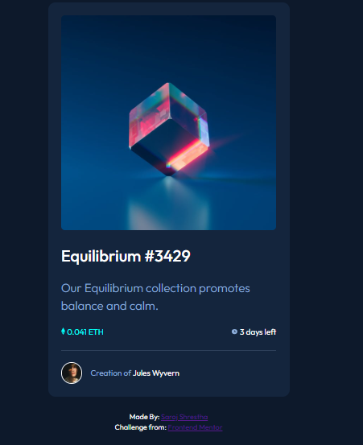
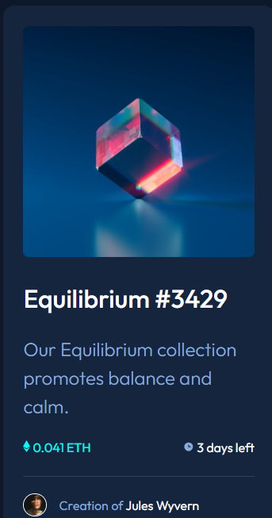
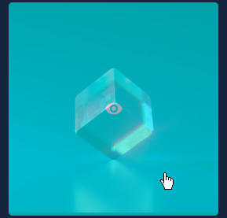
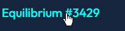

# Frontend Mentor - NFT preview card component solution

This is a solution to the [NFT preview card component challenge on Frontend Mentor](https://www.frontendmentor.io/challenges/nft-preview-card-component-SbdUL_w0U). Frontend Mentor challenges help you improve your coding skills by building realistic projects.

## Table of contents

- [Overview](#overview)
  - [The challenge](#the-challenge)
  - [Screenshot](#screenshot)
  - [Links](#links)
- [My process](#my-process)
  - [Built with](#built-with)
  - [What I learned](#what-i-learned)
- [Author](#author)

## Overview

### The challenge

Users should be able to:

- View the optimal layout depending on their device's screen size
- See hover states for interactive elements

### Screenshot

- Desktop View
  
- Mobile View
  
- Active State
  
  

### Links

- Live Site URL: [Add live site URL here](https://your-live-site-url.com)

## My process

### Built with

- Semantic HTML5 markup
- CSS custom properties
- Flexbox

### What I learned

```css
.img {
  position: relative;
}
.overlay {
  position: absolute;
  top: 0;
  left: 0;
  background-color: hsl(178, 100%, 50%);
  border-radius: 0.5em;
  width: 100%;
  height: 100%;

  display: flex;
  justify-content: center;
  align-items: center;

  opacity: 0;
  transition: opacity 0.25s;
}
.overlay:hover {
  cursor: pointer;
  opacity: 0.6;
}
```

## Author

- Frontend Mentor - [@SarojShrestha10](https://www.frontendmentor.io/profile/SarojShrestha10)
- Twitter - [@AliG08134014](https://www.twitter.com/AliG08134014)
